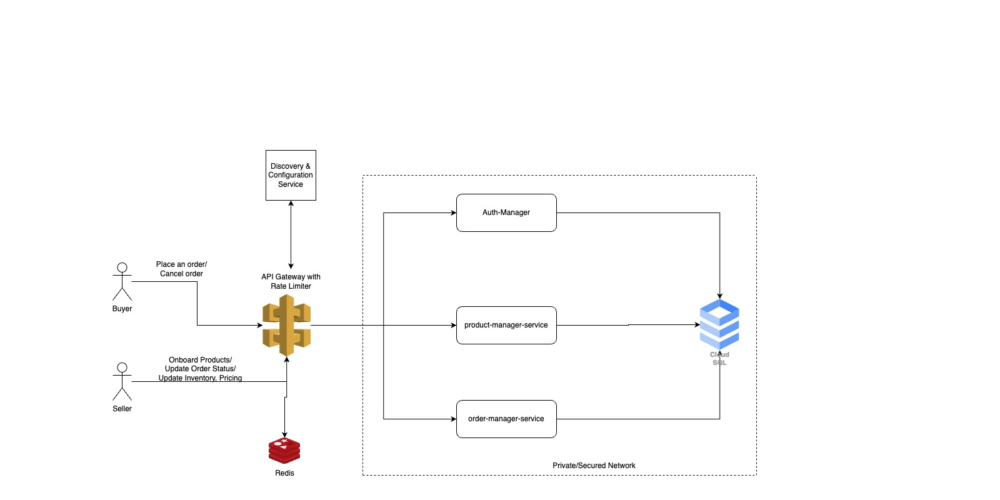

# E-Commerce Backend System

## High - level Architecture:

## Database Design

### Database Tables and Entity Relationships

### User Table
- **Table Name:** `user`
- **Description:** This table stores information about users in the system.

| Field       | Type          | Null | Key | Default | Extra          |
|-------------|---------------|------|-----|---------|----------------|
| user_id     | varchar(36)   | NO   | PRI | NULL    | auto_increment |
| username    | varchar(255)  | NO   |     | NULL    |                |
| email       | varchar(255)  | NO   |     | NULL    |                |
| role        | varchar(50)   | NO   |     | NULL    |                |

### Product Table
- **Table Name:** product
- **Description:** Stores information about products.
  
#### Fields:
| Field Name     | Type        | Nullable | Key | Default | Extra            |
|----------------|-------------|----------|-----|---------|------------------|
| product_id     | VARCHAR(36) | NO       | PRI | NULL    | auto_increment   |
| name           | VARCHAR(255)| NO       |     | NULL    |                  |
| description    | TEXT        | YES      |     | NULL    |                  |
| version        | INT         | NO       |     | 1       |                  |

### Offer Table
- **Table Name:** offer
- **Description:** Stores offers made by sellers for products.

#### Fields:
| Field Name           | Type        | Nullable | Key | Default | Extra            |
|----------------------|-------------|----------|-----|---------|------------------|
| offer_id             | VARCHAR(36) | NO       | PRI | NULL    | auto_increment   |
| product_id           | VARCHAR(36) | NO       | MUL | NULL    |                  |
| seller_id            | VARCHAR(36) | NO       | MUL | NULL    |                  |
| price                | DOUBLE      | YES      |     | NULL    |                  |
| quantity_available   | INT         | NO       |     | NULL    |                  |
| version              | INT         | NO       |     | 1       |                  |

### Entity Relationships

- Each product can have multiple offers associated with it.
- Each offer is associated with one product and one seller.

### Order Table
- **Table Name:** `order`
- **Description:** This table stores information about orders placed by users.

| Field       | Type          | Null | Key | Default | Extra          |
|-------------|---------------|------|-----|---------|----------------|
| order_id    | varchar(36)   | NO   | PRI | NULL    | auto_increment |
| user_id     | varchar(36)   | NO   | MUL | NULL    |                |
| order_date  | datetime      | NO   |     | NULL    |                |
| status      | varchar(50)   | NO   |     | NULL    |                |
| total_price | double        | NO   |     | NULL    |                |

### Order Item Table
- **Table Name:** `order_item`
- **Description:** This table stores items included in each order.

| Field           | Type          | Null | Key | Default | Extra          |
|-----------------|---------------|------|-----|---------|----------------|
| order_item_id   | varchar(36)   | NO   | PRI | NULL    | auto_increment |
| order_id        | varchar(36)   | NO   | MUL | NULL    |                |
| offer_id        | varchar(36)   | NO   | MUL | NULL    |                |
| quantity        | int(11)       | NO   |     | NULL    |                |
| price           | double        | NO   |     | NULL    |                |
| shipping_status | varchar(50)   | YES  |     | NULL    |                |

### Entity Relationships
- **User** has many **Orders**
    - User type Buyer places order
- **Product** can have many **Offers** from different User type - **Sellers**
- **Order** contains multiple **Order Items**, each linked to an **Offer**

## Concurrency Handling

### Product Management Service

In our product management system, we handle concurrency using optimistic locking and versioning. This ensures that concurrent modifications to product and offer entities are detected and resolved appropriately.

## Onboard Product Example

Suppose seller-1 wants to onboard a new product named "Smartwatch" with an initial price of $200 and a quantity available of 50.

### Steps:

1. Begin a transaction to create the new product and offer.
2. Check if the product already exists in the database.
3. If the product exists, then some seller has already onboarded the same item (with same item name & description) and add a new offer record mapping this seller with price and inventory.
4. If the product doesn't exist, create a new product entry and an associated offer within the same transaction.

### Resultant Data Records:

- **New Product**: 
  - Name: Smartwatch
  - Version: 1
- **New Offer**:
  - sellerId: seller-1
  - Price: $200
  - Quantity Available: 50
 
  
Suppose seller-2 wants to onboard the same "Smartwatch" with an initial price of $180 and a quantity available of 100.
- **New Product**: 
  - Name: Smartwatch
  - Version: 1
- **Existing Offer**:
  - Price: $200
  - Quantity Available: 50
- **New Offer**:
  - Price: $180
  - Quantity Available: 100
  

## Edit Product Example

Let's consider selle-1 and seller-2 are editing the "Smartwatch" product concurrently:
- seller-1 updates the price to $190 and increases the quantity available to 150.
- seller-2 updates the price to $195 and increases the quantity available to 110.

### Steps:

1. Begin 2 concurrent transactions to retrieve the product and offer entities.
2. Update the seller-1 's offer record to set price to $190 and quantity to 150 in txn-1 and similarly set the values to $195 and 110 in seller-2's offer.
3. This avoids the conflicts as edit happens in 2 different offer records.

### Resultant Data Records:

- **New Product**: 
  - Name: Smartwatch
  - Version: 1
- **Seller-1 's Offer**:
  - Price: $190
  - Quantity Available: 150
- **Seller-2 's Offer**:
  - Price: $195
  - Quantity Available: 110

## Delete Product Example

Suppose if seller-1 wants to delete the "Smartwatch" product from his catalog

### Steps:

1. Begin a transaction to delete the product and its associated offer.
2. If multiple offers are available for a product, delete the offer record alone.
3. If there is only one offer available, delete both product and offer records.

### Resultant Data Records:

- **New Product**: 
  - Name: Smartwatch
  - Version: 1
- **Seller-2 's Offer**:
  - Price: $195
  - Quantity Available: 110

By following these steps and using optimistic locking, we ensure that concurrent modifications to products and offers are handled effectively in our system.
Also, if a seller tries to edit product information (name/description) then we'll check if there are multiple offers for the same. 
If there are multiple offers, we'll create a new Product entity with modified product details and map exisiting offer with new product.

## Service Details:

### 1. Authentication Service

#### Design Considerations:

- **Purpose:** Provides authentication and authorization functionality.
- **Technology Stack:** Spring Boot, Spring Security, JWT for token-based authentication
- **Endpoints:** Exposes APIs for user authentication and role management.
- **Rate limitting:** Limits the usage abuse by limiting 10 RPS per host address.

#### Implementation Details:

- **User Model:** Defines the structure for storing user information.
- **Authentication Logic:** Handles user authentication and token generation.
- **API Endpoints:** Exposes endpoints for user authentication and role management.

### 2. Product Management Service

#### Design Considerations:

- **Purpose:** Manages products, offers, and inventory.
- **Technology Stack:** Spring Boot, Spring Data JPA, MySQL for data storage.
- **Database:** Stores product details, offers, and inventory information.
- **Concurrency Control:** Implements mechanisms to handle concurrent product updates and inventory management.
- **Endpoints:** Exposes APIs for product management, offer creation, and inventory updates.

#### Implementation Details:

- **Product Model:** Defines the structure for storing product information.
- **Offer Model:** Defines the structure for storing offer details.
- **Inventory Management:** Implements logic to update inventory levels upon order placement.
- **API Endpoints:** Provides endpoints for product CRUD operations, offer creation, and inventory updates.

### 3. Order Management Service

#### Design Considerations:

- **Purpose:** Manages orders and order items.
- **Technology Stack:** Spring Boot, Spring Data JPA, MySQL for data storage.
- **Database:** Stores order details, order items, and related information.
- **Concurrency Control:** Implements mechanisms to handle concurrent order updates and inventory management.
- **Endpoints:** Exposes APIs for order management, order placement, and order status updates.

#### Implementation Details:

- **Order Model:** Defines the structure for storing order information.
- **Order Item Model:** Defines the structure for storing order item details.
- **Inventory Management:** Updates inventory levels upon order placement and cancellation.
- **API Endpoints:** Provides endpoints for order CRUD operations, order placement, and status updates.

### 4. Discovery Service (Eureka)

#### Design Considerations:

- **Purpose:** Service discovery for microservices.
- **Technology Stack:** Spring Cloud Netflix Eureka.
- **Registration:** Microservices register themselves with the Discovery Service.
- **Discovery:** Allows microservices to locate and communicate with each other dynamically.

### 5. Configuration Service (Eureka)

#### Design Considerations:

- **Purpose:** Centralized configuration management.
- **Technology Stack:** Spring Cloud Config Server.
- **Externalized Configuration:** Stores configuration properties externally for microservices.
- **Dynamic Updates:** Supports dynamic updates to configuration properties.

### 6. API Gateway Service

#### Design Considerations:

- **Purpose:** Entry point for client requests.
- **Technology Stack:** Spring Cloud Gateway, Redis for rate limiting.
- **Routing:** Routes requests to appropriate microservices.
- **X-UserId Header:** Enriching X-UserId header by extracting userName from the JWT token and adding it while redirecting to downstream services to restrict unauthorized access to orders and offers. 
- **Rate Limiting:** Implements rate limiting using Redis to prevent excessive requests.
- **Security:** Provides a layer of security and authentication.

## Local Setup

### Pre-requisites:

- Java 17 or above
- Maven
- Redis

### Steps

- Clone the repository.
- Make sure the Redis instance is running locally at localhost:6379
- Run the Discovery service and Config service first and then start other services (API gateway service, Auth Manager Service, Product Manager Service and Order Manager Service) in any order.
- Register a new user / Login using existing test credentials.
  - **Seller:** User Name : vimal Password: password1234
  - **Buyer:** User Name : vijay Password: password1234
- Login and fetch the token value from the response.
- Append the token value with 'Authorization' header key as part of the request.

## API Endpoints:

### POST User Registration:

curl --location --request POST 'http://localhost:8080/api/v1/auth/register' \
--header 'Content-Type: application/json' \
--header 'Cookie: JSESSIONID=D7C782B20BA24F670C690C0F040B1AA9' \
--data-raw '{
    "email": "buyer1@sample.com",
    "userName": "buyer1",
    "password": "pass1234"
}'

### POST User Login:

curl --location --request POST 'http://localhost:8080/api/v1/auth/login' \
--header 'Content-Type: application/json' \
--header 'Cookie: JSESSIONID=D7C782B20BA24F670C690C0F040B1AA9' \
--data-raw '{
    "userName": "seller1",
    "password": "pass1234"
}'

### POST Onboard Product (For Sellers) :

curl --location --request POST 'http://localhost:8080/api/v1/seller/product' \
--header 'Content-Type: application/json' \
--header 'Authorization: <JWT token>' \
--data-raw '{
    "productName": "iPhone 13 red 256GB",
    "productDescription": "Lorem ipsum",
    "availableInventory": 50,
    "price": 85000.00,
    "sellerId": "f5423841-7a8a-4044-a2d3-6f4dcccce51c"
}'

### PUT Edit Product (For Sellers) :

curl --location --request PUT 'http://localhost:8080/api/v1/seller/product' \
--header 'Content-Type: application/json' \
--header 'Authorization: <JWT token>' \
--header 'Cookie: JSESSIONID=D7C782B20BA24F670C690C0F040B1AA9' \
--data-raw '{
    "productId": "3e185d36-7a75-4a16-ac61-97cba5e92446",
    "offerId": "14bb6a1f-7060-47aa-bd25-6f1007165404",
    "availableInventory": 50,
    "price": 81000.00,
    "sellerId": "f5423841-7a8a-4044-a2d3-6f4dcccce51c"
}'

### DELETE Delete Product (For Sellers) :

curl --location --request DELETE 'http://localhost:8082/api/v1/seller/product?productId=3e185d36-7a75-4a16-ac61-97cba5e92446&sellerId=f5423841-7a8a-4044-a2d3-6f4dcccce51c' \
--header 'Content-Type: application/json' \
--header 'Authorization: <JWT token>'

### GET Product Catalog(For Sellers) (Paginated):

curl --location --request GET 'http://localhost:8080/api/v1/seller/products?sellerId=23b270a5-045b-4523-8a03-a2e640e6d3a4&pageNo=0&pageSize=10' \
--header 'Content-Type: application/json' \
--header 'Authorization: <JWT token>'

### GET Product Search (For Buyers - highlighting lowest seller offer) (Paginated):

curl --location --request GET 'http://localhost:8080/api/v1/products/search?searchQuery=phone' \
--header 'Content-Type: application/json' \
--header 'Authorization: <JWT token>'

### GET Product Search (For Buyers - highlighting lowest seller offer) (Paginated):

curl --location --request GET 'http://localhost:8080/api/v1/products/search?searchQuery=phone' \
--header 'Content-Type: application/json' \
--header 'Authorization: <JWT token>' \
--header 'Cookie: JSESSIONID=D7C782B20BA24F670C690C0F040B1AA9'

### POST Place an order:

curl --location --request POST 'http://localhost:8080/api/v1/order' \
--header 'Content-Type: application/json' \
--header 'Authorization: <JWT token>' \
--data-raw '{
    
    "orderItems":[
        {
            "offerId":"14bb6a1f-7060-47aa-bd25-6f1007165404",
            "quantity": 2
        },
        {
            "offerId":"68003706-56cc-4b0a-9c09-553be2a0e6a8",
            "quantity": 3
        }
    ]
}'

### PUT Cancel  Order (Order Item Wise):

curl --location --request PUT 'http://localhost:8080/api/v1/order/29677691-3c1d-4698-ae8e-6b355b806c35/cancel' \
--header 'Content-Type: application/json' \
--header 'Authorization: <JWT token>' \
--data-raw '{
    
    "orderItemIds":["efdaa916-e142-45c8-84c4-adabeab102fb"]
}'

### GET Get all orders (For Sellers) (Order Item Wise) (Paginated):

curl --location --request GET 'http://localhost:8080/api/v1/seller/orders' \
--header 'Content-Type: application/json' \
--header 'Authorization: <JWT token>' \
--header 'Cookie: JSESSIONID=D7C782B20BA24F670C690C0F040B1AA9'

